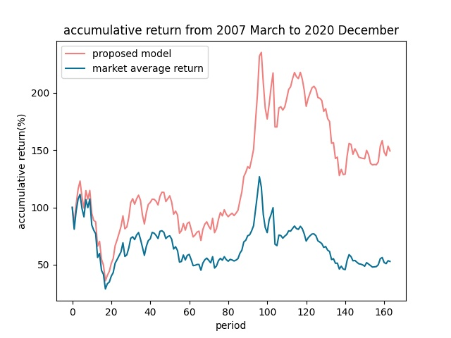
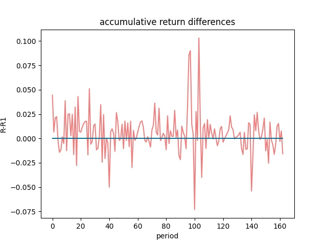

# 实验笔记

## 数据处理

使用数据

* price.pkl：股票价格数据

* month_data_feature45_new.pkl：股票特征数据

### price.pkl

price.pkl

| 字段         | 含义                   | 注释                           |
| ------------ | ---------------------- | ------------------------------ |
| trade_date   | 交易日                 | YYYYMMDD交易日，不包含非交易日 |
| open         | 开盘价（元）           |                                |
| high         | 最高价（元）           |                                |
| low          | 最低价（元）           |                                |
| close        | 收盘价（元）           |                                |
| pre_close    | 4.1584                 |                                |
| change       | close-pre_close        |                                |
| pct_chg      | 100*(change/pre_close) |                                |
| vol          |                        |                                |
| amount       |                        |                                |
| Ind_Name     |                        |                                |
| ZZ500Ret     |                        |                                |
| ZZ500_Weight |                        |                                |
| ts_code      |                        |                                |

### month_data_feature45_new.pkl

```
factor_list = ['ret', 'ret_max', 'std_ret', 'std_vol', 'pe_ratio', 'turnover_ratio',
               'pb_ratio', 'ps_ratio', 'pcf_ratio', 'capitalization', 'market_cap',
               'circulating_cap', 'circulating_market_cap', 'pe_ratio_lyr', 'eps',
               'adjusted_profit', 'operating_profit', 'value_change_profit', 'roe',
               'inc_return', 'roa', 'net_profit_margin', 'gross_profit_margin',
               'expense_to_total_revenue', 'operation_profit_to_total_revenue',
               'net_profit_to_total_revenue', 'operating_expense_to_total_revenue',
               'ga_expense_to_total_revenue', 'financing_expense_to_total_revenue',
               'operating_profit_to_profit', 'invesment_profit_to_profit',
               'adjusted_profit_to_profit', 'goods_sale_and_service_to_revenue',
               'ocf_to_revenue', 'ocf_to_operating_profit',
               'inc_total_revenue_year_on_year', 'inc_total_revenue_annual',
               'inc_revenue_year_on_year', 'inc_revenue_annual',
               'inc_operation_profit_year_on_year', 'inc_operation_profit_annual',
               'inc_net_profit_year_on_year', 'inc_net_profit_annual',
               'inc_net_profit_to_shareholders_year_on_year',
               'inc_net_profit_to_shareholders_annual']
```


### 数据处理难点

* price为日线数据，feature为每月数据。需统一成月/季度数据
* price和feature的时间跨度不同。需要取交集
* 二者包含的股票可能不同。需找到股票的交集
* 金融股票和ST的数据
* price和feature数据的不完整性。
  * 情况一：因为某些原因缺失部分交易数据或特征数据。用上一个时间片/点的数据补全
  * 情况二：由于股票上市较晚而造成的大段数据缺失。不能加入训练数据（文中数据划分策略下Notice that this data splitting strategy, with a varying size of training set across different periods），但可以加入测试数据。目前尚未加入

## 实验结果

### 模型有效性

monthly



上述结果可以初步证明模型的有效性

## 现有问题及原因

* 候选股票总体质量不高
  * 没有去掉金融股票和ST股票
  * 测试的时候依然选取了2007年3月有数据的股票，未考虑后续上市的股票
* 模型效果不佳
  * indicator未设置正负，导致初始化没有完全利用先验，如果已知特征的indicator，可将系数初始化在正数范围内
  * feature待优化
  * 由于测试开始时间之后发行的股票没有被统计在训练集内
  * 使用论文中找到的最优参数，尚未调参
  * 终止策略(2)不同，The difference between the best objective value amongst all generations and the average objective value of the latest 15 generations can be controlled under the tolerance  $ tol=10^{-5}$
* 没有按季度的实验结果，难以与论文对比
* 实验未重复，所以结果不稳定

