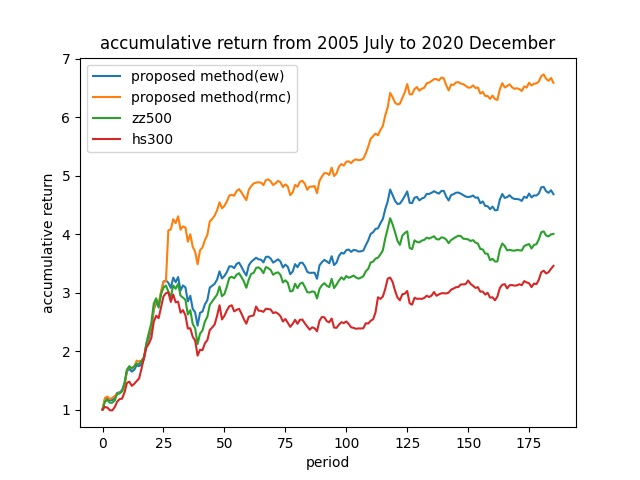

# 7.7笔记

##待实现内容
在计算累计收益的时候，用单利方式计算。在比较结果的时候，需要这几条收益曲线：根据这个算法构建的投资组合、和中证500指数对冲、和沪深300指数对冲、中证500指数、沪深300指数。这里对冲收益就是拿算法的收益减去指数的收益。

## 结果呈现设计
以曲线图的方式呈现累计收益结果（单利），在show_result.py中对结果进行展示。

* 图1：等权投资组合、市权投资组合、中证500、沪深300
* 图2：等权投资组合和中证500对冲、等权投资组合和沪深300对冲、市权投资组合和中证500对冲、市权投资组合和沪深300对冲

## 实验1 关于投资组合的权重实验

### 定义A0参数设置

#### 训练/测试数据

t时刻特征与t+1时刻回报率数据完整的股票

#### 模型相关参数

| 参数名称          | 含义                   | 默认值  |
| ----------------- | ---------------------- | ------- |
| P                 | 种群数量               | 30      |
| Cr                | 杂交率$\in(0,1)$       | 0.5     |
| beta              | 变异阶段的缩放因子     | 0.6     |
| G                 | 迭代次数               | 50      |
| tol               | 终止因子（暂未实现）   | 0.00001 |
| m_rate            | 所选股票占总股票的比重 | 0.2     |
| min_train_periods | 最小训练时间片         | 2       |

#### 训练相关参数

| 参数名称            | 含义                                                         | 默认值    |
| ------------------- | ------------------------------------------------------------ | --------- |
| min_train_periods   | 最小训练时间片                                               | 2         |
| times_per_case      | 每个case的次数                                               | 1         |
| num_feat_timestamps | 输入历史特征的时间片数                                       | 1         |
| padding_or_ignore   | 当输入历史特征有数据缺失时采取的策略。padding代表填充，ignore将忽略数据缺失的股票 | "padding" |

#### 评价相关参数

| 参数名称 | 含义                                      | 默认值 |
| -------- | ----------------------------------------- | ------ |
| TC       | transaction cost交易成本                  | 0.001  |
| N_Y      | 一年包含的时间片段                        | 12     |
| MAR      | minimum acceptable return最低可接受的回报 | 0      |

### 实验结果（每个case一次）
#### 累计收益图
图1
其中ew表示等权重，mc表示市值为权重
图2
表示ew，mc对冲中证500，沪深300的结果
图1
其中ew表示等权重，rmc表示市值倒数为权重
图2
表示ew，rmc对冲中证500，沪深300的结果

|                        | APR(+)    | AVOL(-)   | ASR(+)    | MDD(-)    | CR(+)     | DDR(+)    |
| ---------------------- | --------- | --------- | --------- | --------- | --------- | --------- |
| 中证500                | 0.177     | 0.329     | 0.536     | 10.764    | 0.016     | 2.974     |
| 沪深300                | 0.148     | 0.294     | 0.503     | 0.892     | 0.166     | 2.741     |
| A0等权重               | 0.232     | 0.308     | 0.753     | 0.890     | 0.261     | 4.540     |
| A0按市值权重的结果     | 0.166     | **0.291** | 0.569     | 0.907     | 0.183     | 3.154     |
| A0按市值倒数权重的结果 | **0.382** | 0.393     | **0.972** | **0.841** | **0.454** | **7.879** |

### 结果分析

1. 模型有效性(√)
2. A0按市值权重所做的投资组合在年化波动率指标上表现较好，其他指标均弱于A0。波动率低说明在所选的m支股票中的市值大的股票走势稳定，其他指标弱说明所选股票收益率可能与市值大小有负相关关系。（引出A0市值权重**倒数**的实验）
3. A0按市值倒数权重所做的投资组合在除了AVOL的所有指标上都超过了等权重和按市值权重的结果，推测原因在于能够捕捉刚上市，市值较低但成长较快的股票。虽然其AVOL较大，但考虑到DDR明显高于其他权重组合，可以认为其不稳定性更多来源于大于均值的投资组合回报率的离群值。
4. 上述结果存在一定误差，但不影响上述结论。后续会对误差进行分析。

故今后将`A0等权重`和`A0按市值倒数权重的结果`作为baseline进行后续的实验。

