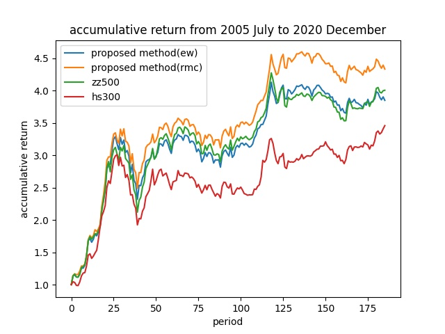
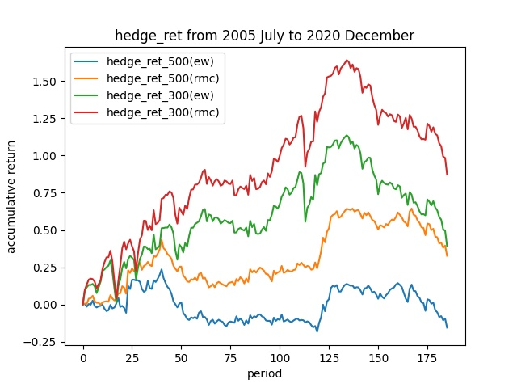
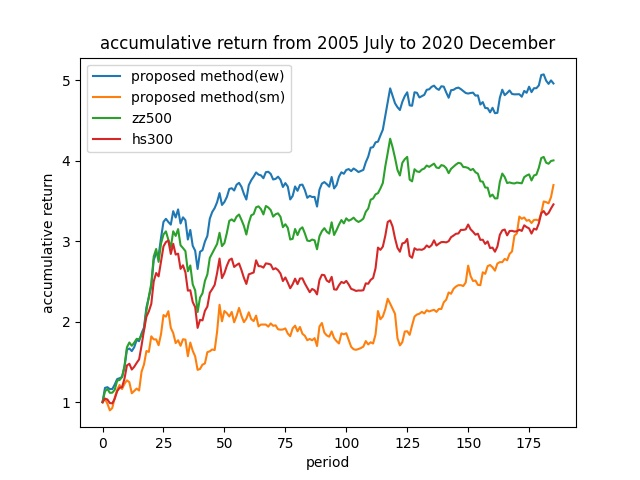
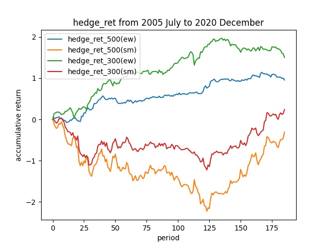

# 7.8 笔记

## 实验A0_20：所选股票市值对投资组合回报的影响
在每个时间阶段排除市值最低的20%股票，与原训练/测试数据的投资组合结果进行比较。

图1：排除市值最低的20%股票后等权/市值倒数权重的累积回报率

图1：排除市值最低的20%股票后等权/市值倒数权重的累积回报率（与中证500，沪深300对冲）

|                       | APR(+)    | AVOL(-)   | ASR(+)    | MDD(-)    | CR(+)     | DDR(+)    |
| --------------------- | --------- | --------- | --------- | --------- | --------- | --------- |
| 中证500               | 0.177     | 0.329     | 0.536     | 10.764    | 0.016     | 2.974     |
| 沪深300               | 0.148     | **0.294** | 0.503     | 0.892     | 0.166     | 2.741     |
| A0（等权）            | **0.232** | 0.308     | **0.753** | 0.890     | **0.261** | **4.540** |
| A0_20（等权）         | 0.173     | 0.318     | 0.544     | 0.895     | 0.193     | 3.103     |
| A0_20（市值倒数权重） | 0.204     | 0.329     | 0.620     | **0.878** | 0.232     | 3.657     |

* 去除市值较低的20%的股票后，等权收益率有了明显下降。说明小市值股票的选择对提升投资组合的回报率至关重要。故后续试验对小市值股票进行保留，考虑到股票流动性，构建等权投资组合。

## 实验A0_sm：所选股票市值对投资组合回报的影响

除等权、市值权重、市值倒数权重，还可以用softmax构建投资组合。

|               | APR(+)    | AVOL(-)   | ASR(+)    | MDD(-)    | CR(+)     | DDR(+)    |
| ------------- | --------- | --------- | --------- | --------- | --------- | --------- |
| 中证500       | 0.177     | 0.329     | 0.536     | 10.764    | 0.016     | 2.974     |
| 沪深300       | 0.148     | **0.294** | 0.503     | 0.892     | 0.166     | 2.741     |
| A0（等权）    | **0.232** | 0.308     | **0.753** | **0.890** | **0.261** | **4.540** |
| A0（softmax） | 0.163     | 0.317     | 0.514     | 4.95      | 0.033     | 3.048     |

由于市值数据较大，softmax会溢出，故此处的softmax权重投资组合是是市值除以市值均值后softmax的权重。

* softmax相比于市值权重会进一步放大市值大的股票的权重，故从长期来看效果不佳。
* 值得注意的是，在后5年（60个月），softmax权重的累计收益率要明显大于等权重的结果。可能原因：
  * 训练数据越充足，越能学习到收益率高的大市值股票
  * 股票总体趋势的变化
  * 选取的股票越来越多