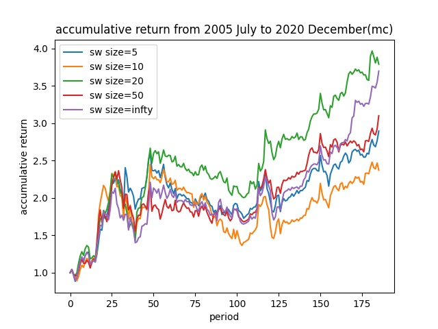
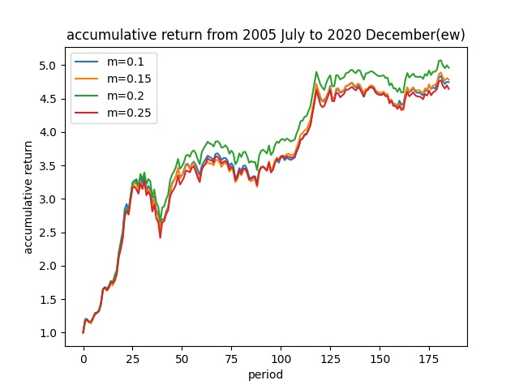
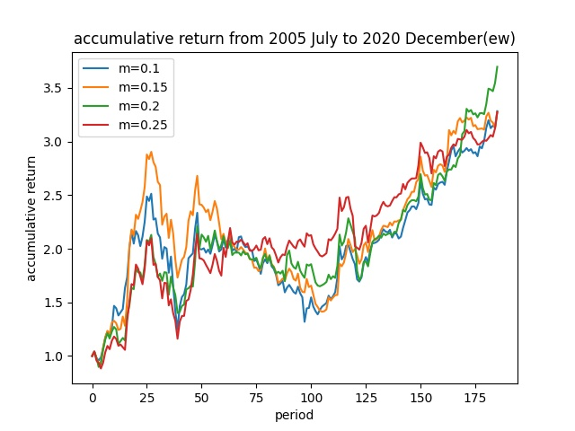

# 7.9笔记

## A0_sw 滑动窗口

### 目的

确定不同训练集大小是否会对训练效果产生显著影响。

### 方法

用window size来控制训练数据的最大长度

### 结果

等权情况下

| ew(window size) | APR(+)    | AVOL(-)   | ASR(+)    | MDD(-)    | CR(+)     | DDR(+)    |
| --------------- | --------- | --------- | --------- | --------- | --------- | --------- |
| A0(5)           | 0.202     | 0.308     | 0.656     | 0.905     | 0.223     | 3.791     |
| A0(10)          | 0.220     | 0.308     | 0.712     | 0.896     | 0.245     | 4.198     |
| A0(20)          | 0.221     | 0.308     | 0.716     | 0.896     | 0.246     | 4.291     |
| A0(50)          | 0.225     | 0.307     | 0.733     | 0.894     | 0.252     | 4.389     |
| A0(inf）        | **0.245** | **0.305** | **0.803** | **0.885** | **0.277** | **4.998** |

softmax

| sm(window size) | APR(+)    | AVOL(-)   | ASR(+)    | MDD(-)   | CR(+)     | DDR(+)    |
| --------------- | --------- | --------- | --------- | -------- | --------- | --------- |
| A0(5)           | 0.110     | 0.336     | 0.330     | 3.723    | 0.030     | 1.886     |
| A0(10)          | 0.077     | 0.354     | 0.218     | 6.355    | 0.012     | 1.235     |
| A0(20)          | **0.169** | 0.335     | 0.504     | 25.424   | 0.007     | **3.199** |
| A0(50)          | 0.124     | **0.314** | 0.396     | 5.738    | 0.022     | 2.178     |
| A0(inf）        | 0.163     | 0.317     | **0.514** | **4.95** | **0.033** | 3.048     |

### 分析

* 在相对较小的训练集下，训练数据的后50个月的等权投资组合表现不如softmax，与之前实验中最大化训练数据的结果一致。排除训练数据时间长短对投资组合比较优势的影响。
* 从ASR和CR角度来看，等权情况下，训练数据时间越长，模型效果越好；而用softmax构建的投资组合受更多随机因素影响，但在最大训练数据下依然表现出最佳的性能。

## A1_m 选取股票百分比

### 目的

研究选取的股票数目对投资回报率的影响

### 结果

等权情况

| ew(m)   | APR(+)    | AVOL(-)   | ASR(+)    | MDD(-)    | CR(+)     | DDR(+)    |
| ------- | --------- | --------- | --------- | --------- | --------- | --------- |
| A1(10%) | 0.231     | 0.311     | 0.743     | 0.905     | 0.255     | 4.481     |
| A1(15%) | 0.233     | 0.309     | 0.755     | 0.895     | 0.261     | 4.591     |
| A1(20%) | **0.245** | **0.305** | **0.803** | **0.885** | **0.277** | **4.998** |
| A1(25%) | 0.224     | 0.306     | 0.734     | 0.889     | 0.252     | 4.389     |

softmax情况下

| sm(m)    | APR(+)    | AVOL(-)   | ASR(+)    | MDD(-)    | CR(+)     | DDR(+)    |
| -------- | --------- | --------- | --------- | --------- | --------- | --------- |
| A1(10%)  | 0.136     | 0.336     | 0.405     | 16.946    | 0.008     | 2.134     |
| A1(15%)  | 0.136     | 0.353     | 0.384     | 7.779     | 0.0174    | 2.229     |
| A1(20%） | **0.163** | 0.317     | **0.514** | 4.95      | **0.033** | **3.048** |
| A1(25%)  | 0.136     | **0.312** | 0.434     | **4.125** | **0.033** | 2.454     |

### 分析

* 等权情况下，选取20%的股票在所有指标上最佳。
* sigmoid权重下，选取20%的股票做投资组合在ASR和CR指标上表现最佳

## A2 更改优化目标

### 目的

原先采用IC作为优化目标，现考虑sharpe ratio和return。

### 数据集

构造50月数据集，从2016年11月到2020年12月，以加快实验速度。

### 结果

等权情况

| ew(优化指标) | APR(+)     | AVOL(-)   | ASR(+)     | MDD(-)    | CR(+)       | DDR(+)     |
| ------------ | ---------- | --------- | ---------- | --------- | ----------- | ---------- |
| A2(sharpe)   | -0.017     | 0.183     | -0.095     | 3.412     | -0.005      | -0.532     |
| A2(return)   | -0.037     | **0.171** | -0.220     | **2.940** | -0.013      | -1.173     |
| A2(IC）      | **-0.009** | 0.172     | **-0.053** | 35.614    | **-0.0003** | **-0.288** |

sigmoid情况

| sigmoid(优化指标) | APR(+)    | AVOL(-)   | ASR(+)    | MDD(-)    | CR(+)     | DDR(+)    |
| ----------------- | --------- | --------- | --------- | --------- | --------- | --------- |
| A2(sharpe)        | 0.267     | 0.253     | 1.057     | 22.85     | 0.012     | 7.737     |
| A2(return)        | 0.253     | 0.240     | 1.056     | 0.967     | 0.262     | 6.968     |
| A2(IC）           | **0.270** | **0.213** | **1.270** | **0.639** | **0.423** | **9.395** |

### 分析

1. 关于returns优化指标表现不佳可以做如下解释：由于训练数据时间跨度较大，且股票总体走势不稳定，returns优化指标会过度关注训练数据中行情较好的月份的指标，而测试集只有一个月，这种被关注的特征在测试集中未必能表现出来。
2. sharpe指标表现不好的原因同上。
3. 尝试使用滑动窗口与return的组合

## A3 滑动窗口与return的组合

### 数据集

构造50月数据集，从2016年11月到2020年12月，以加快实验速度。

### 结果

等权情况

| ew(优化指标，窗口大小) | APR(+)     | AVOL(-)   | ASR(+)     | MDD(-)    | CR(+)       | DDR(+)     |
| ---------------------- | ---------- | --------- | ---------- | --------- | ----------- | ---------- |
| A3(return,5)           | -0.025     | 0.197     | -0.127     | 10.183    | -0.002      | -0.693     |
| A3(return,10)          | -0.031     | **0.171** | -0.178     | 21.272    | -0.001      | -0.894     |
| A3(return,infty)       | -0.037     | **0.171** | -0.220     | **2.940** | -0.013      | -1.173     |
| A3(IC,infty）          | **-0.009** | 0.172     | **-0.053** | 35.614    | **-0.0003** | **-0.288** |

sigmoid情况

| sigmoid(优化指标，窗口大小) | APR(+)    | AVOL(-)   | ASR(+)    | MDD(-)    | CR(+)     | DDR(+)    |
| --------------------------- | --------- | --------- | --------- | --------- | --------- | --------- |
| A3(return,5)                | 0.255     | 0.271     | 0.940     | 0.827     | 0.308     | 6.475     |
| A3(return,10)               | 0.119     | 0.246     | 0.484     | 0.766     | 0.155     | 2.756     |
| A3(return,infty)            | 0.253     | 0.240     | 1.056     | 0.967     | 0.262     | 6.968     |
| A3(IC,infty）               | **0.270** | **0.213** | **1.270** | **0.639** | **0.423** | **9.395** |

### 分析

1. 结果表明，当用return做优化指标时，窗口较小时的结果确实会优于最大化训练窗口的情况，但由于训练数据过少，总体效果不如以IC为优化指标，最大化训练数据要好。