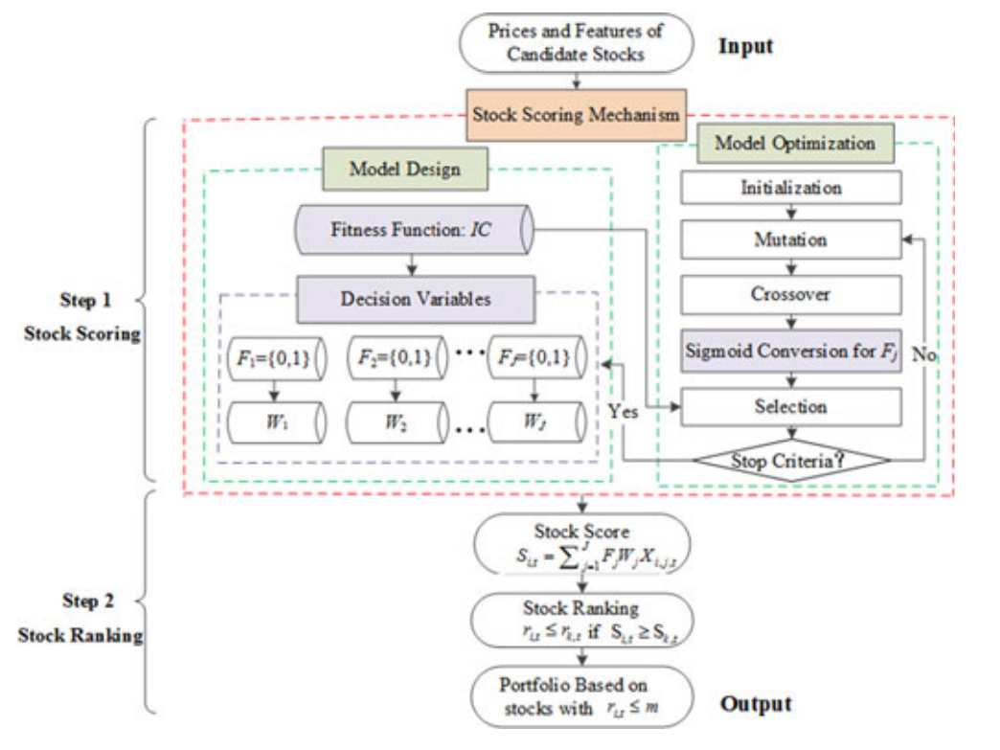
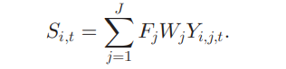
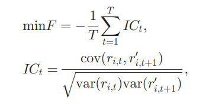
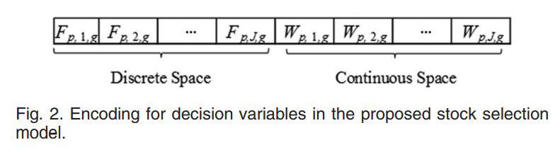
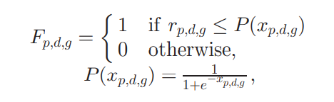
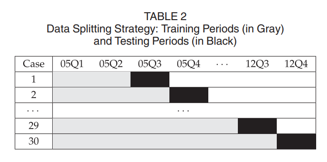

# 论文要点

## 背景介绍

### 股票投资组合

一般来说，选股模型包括两个主要步骤，即股票打分和股票排名，其中前者可能是核心部分。

股票打分（评价）分为两类：**传统的统计回归方法**和**计算智能（CI**）技术

### 传统的统计回归方法

* 形式简单，容易实现和理解。
* 相对较差的性能。
* CAPM、APT

### **计算智能（CI**）

* 比传统的统计模型更有效
* 可能有些难以理解
* 人工神经网络（ANNs）、支持向量机（SVMs）和各种优化工具（如微分进化（DE））

### DE算法

**DE算法作为一种典型的进化算法（EA），已经被广泛地应用于金融市场分析**

特征选择：最关键的任务，降低计算复杂度，保证股票评分机制的模型通用性。

* 过滤法：根据统计学特性去除信息量小的特征
* **包装法（证明有效）**：根据预测能力探索特征空间，对特征子集进行评分
* 嵌入法：根据初步已知的规则来训练模型，否则由于对规则的无知而限制了其应用

将只关注连续问题的典型DE算法**扩展到一个新颖的混合的离散-连续变体**，对离散部分进行基于sigmoid的转换。

## 方法

一种新型的基于sigmoid的混合离散-连续差分进化算法。

### 框架

### 模型设计

1. 构造25个特征$$V_{i,j,t}$$ 股票i在时间t的第j个特征的值

2. 特征的Z-score归一化：$$V_{i,j,t}$$ ->$$Y_{i,j,t}$$.$$Y_{i,j,t}$$被假设为遵循均值为零、偏差为一的正态分布

3. 学习$$F_j$$和$$W_j$$：二元变量$$F_j=\{0,1\}$$来表示特征$j$是否用于股票评估，$W_j$表示第$j$个特征的权重。

4. 股票$i$在时间$t$的最终得分$S_{i,t}$可以用各种特征$j$的线性组合来估计。$$j={1,2,...,J}$$

   

5. 排名：$r_{i,t} \le r_{k,t}$  if  $S_{i,t}\ge S_{k,t}$

6. 目标函数（即适应性函数）：

   

7. 确定回报：选择每个阶段结束时排名前$m$的股票$r_{i,t}=\{1,2,...,m\}$，可以为下一阶段构建一个等权的组合。
   因此，所制定的投资组合在下一阶段的表现可以被评价为所有被选中的股票的平均回报率

   

### 模型优化

#### 典型DE

1. Initialization
2. mutation
3. Crossover
4. selection

参考：[Differential Evolution: A Practical Approach to Global Optimization - Kenneth Price, Rainer M. Storn, Jouni A. Lampinen - Google 图书](https://books.google.com.hk/books?hl=en&lr=&id=hakXI-dEhTkC&oi=fnd&pg=PR7&dq=Differential+Evolution:+A+Practical+Approach+to+Global+Optimization&ots=c0_FGWPd5_&sig=q6mdDbaEyCbeTPR8d4gDKTgglX8&redir_esc=y&hl=zh-CN&sourceid=cndr#v=onepage&q=Differential Evolution%3A A Practical Approach to Global Optimization&f=false)

#### SigDE

决策变量分为两部分

离散项$F_{p,j,g}=\{0,1\}$表示在迭代$g$的第$p$个解决方案中对特征$j$的选择决定，连续项$W_{p,j,g} \in [0,1]$是相应的权重。

值得注意的是，如果特征$j$在迭代$g$的解决方案$p$中没有被选择，即$F_{p,j,g}=0$，相应的权重$W_{p,j,g}$相应地被设置为0。

如何由连续变量到离散变量：sigmoid函数

## 实验

### 数据

* 上海A股市场
* 共考虑了483只股票，排除了因资产负债表结构不同而导致的金融业股票以及因不稳定而不值得长期投资而被标记为特殊处理（ST）的股票
* 从2005年的第一季度到2012年的第四季度
* 股票收益率以价格比率的自然对数计算（即$R_{i,t}=ln(P_{it}/P_{i,t-1})$
* 候选特征：23个基本面特征和2个技术面特征

### 方法

数据分割策略:在不同时期使用不同大小的训练集

### benchmark

* 其他决策函数
* 其他适应性函数
* 其他优化策略

## 实验结果

略

# 补充笔记：

## 遗传算法：（Genetic Algorithm）

[【算法】超详细的遗传算法(Genetic Algorithm)解析 - 简书 (jianshu.com)](https://www.jianshu.com/p/ae5157c26af9)

如何通俗易懂地解释遗传算法？有什么例子？ - 严晟嘉的回答 - 知乎 https://www.zhihu.com/question/23293449/answer/120220974

2.1 编码与解码

2.2 个体与种群

2.3 适应度函数

2.4 遗传算子

1. 选择
2. 交叉
3. 变异

一般来说，交叉概率(cross_rate)比较大，变异概率(mutate_rate)极低。

## 差分进化算法（differential evolution，DE）

[差分进化算法 - 一菲宝宝 - 博客园 (cnblogs.com)](https://www.cnblogs.com/babyfei/p/9552418.html)

